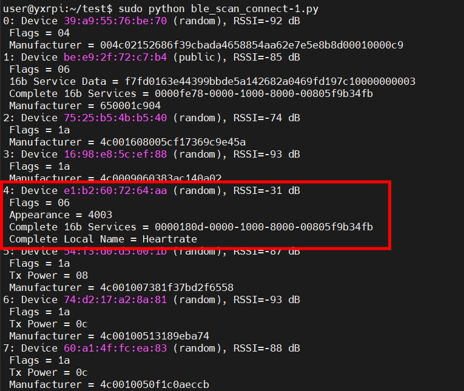

# BLE_GattServer_AddMyService
## 【實驗目的】
1. 使用BLE_GattServer_AddService專案。將STM32作為Peripheral(BLE中的Server)，RPi作為Central(BLE中的Client)，藉由藍芽(BLE)進行連線。  
2. 修改BLE_GattServer_AddService專案，使其除了heart rate(心率偵測)以外，還提供magnetometer(磁力計)的service。
3. 畫出程式執行的時序圖，並描述event_quene怎麼運作的。

## 【實驗步驟】
**1. 修改程式**
1. 在Mbed Studio 中 import empty os。
2. add lib: https://os.mbed.com/teams/ST/code/BSP_B-L475E-IOT01/
3. 下載網址裡面的main.cpp取代empty os的: https://github.com/ARMmbed/mbed-os-example-ble/tree/development/BLE_GattServer_AddService  
也可以使用downgit下載整個專案。(不知道為甚麼沒辦法直接import)(如果要使用要去把mbed_app.json刪掉或使用其他專案的mbed_app.json取代 否則會無法編譯)  
4. 參考這兩個檔案撰寫自己的service
mbed-os/connectivity/FEATURE_BLE/include/ble/services/EnvironmentalService.h # 程式碼較簡單
mbed-os/connectivity/FEATURE_BLE/include/ble/services/HeartRateService.h # 程式碼較難
5. 修改main.cpp和上次作業中在RPi執行的py檔案

**2. 復現方式**
1. new新的empty os。
2. 右上角file -> add lib: https://os.mbed.com/teams/ST/code/BSP_B-L475E-IOT01/  
3. 將本專案附的"main.cpp", "HeartRateService.h", "MagnetoService.h", "pretty_printer.h"直接複製進去。
4. 先在mbed studio中執行這個專案，會看到以下輸出:  
        
5. 接著在RPi執行sudo hcitool lescan，藉由STM32中設置的device name，查到service的UUID。
   
6. 接著ble_scan_connect-1.py，會看到以下輸出:  
   
7. 以圖為例我們的service在這次掃描中編號為「4」，輸入4即可建立藍芽連線。  
   

**3. 其他實作server方式**
預設為計時的服務:https://os.mbed.com/teams/mbed-os-examples/code/mbed-os-example-ble-GattServer/

## 【問題討論】
Q: **畫出程式執行的時序圖，並描述event_quene怎麼運作的。**  
A: 
### 本專案的時序圖

1. 初始化
   - 初始化 mbed trace。
   - 初始化 BLE instance。
   - 初始化 HeartrateDemo。

2. HeartrateDemo::start()
   - 呼叫 _ble.init()。
     - 設定初始化完成的回調函數為 HeartrateDemo::on_init_complete()。

3. BLE 堆疊初始化完成
   - 呼叫 HeartrateDemo::on_init_complete()。
     - 列印 MAC 地址。
     - 設置 Gap::EventHandler。
     - 每一秒鐘，呼叫 update_sensor_value() 更新心率和磁力計的數值。
     - 呼叫 start_advertising() 開始廣播。

4. 其他 BLE 裝置連接
   - 呼叫 onConnectionComplete()。
     - 列印連接的訊息。

5. 連接裝置斷開連接
   - 呼叫 onDisconnectionComplete()。
     - 重新開始廣播等待其他裝置連接。

6. update_sensor_value()
   - 更新心率值和磁力計的 XYZ 值。
     - 如果心率值超過 110，則重設為 60。

7. 程式進入 _event_queue.dispatch_forever()。
   - 處理所有的事件，包括 BLE 事件和定時更新 sensor 值的事件。

### Event Quene
#### 使用這三個方法排程佇列(還不會執行)：
```cpp
1. EventQueue::call() # 添加一個function到quene中  
2. EventQueue::call_in(t, function()) #  延遲t ms以後 添加一個function到quene中  
3. EventQueue::call_every(t, function()) # 系統時間每過t ms就插入執行一次這個function  
```
#### 使用這兩個方法執行佇列：  
```cpp
1. EventQueue::dispatch() # 只會執行一次  
2. EventQueue::dispatch_forever() # 無窮迴圈執行  
```

#### 本專案當中的event quene：  
建立 EventQueue為一個全局變數，並設定了事件數量為 16 * EVENTS_EVENT_SIZE。
```cpp
static events::EventQueue event_queue(/* event count */ 16 * EVENTS_EVENT_SIZE);
```

在 HeartrateDemo 的結構函數中，使用_event_queue初始化event_queue。
```cpp
HeartrateDemo(BLE &ble, events::EventQueue &event_queue) :
    _ble(ble),
    _event_queue(event_queue),
    ...
```

使用call_every排程，定時更新心率和磁場的值。
```cpp
_event_queue.call_every(
    1000ms,
    [this] {
        update_sensor_value();
    }
);
```
update_sensor_value()的內容，其中update{service}是.h當中include的內容，原專案只有heartrate，需要自己仿照寫出magneto。
```cpp
    void update_sensor_value()
    {
        /* you can read in the real value but here we just simulate a value */
        _heartrate_value++;

        /*  60 <= bpm value < 110 */
        if (_heartrate_value == 110) {
            _heartrate_value = 60;
        }
        BSP_MAGNETO_GetXYZ(pDataXYZ);

        _heartrate_service.updateHeartRate(_heartrate_value);
        _magneto_X_service.updateMagnetoValue(pDataXYZ[0]);
        _magneto_Y_service.updateMagnetoValue(pDataXYZ[1]);
        _magneto_Z_service.updateMagnetoValue(pDataXYZ[2]);
    }
```
使用特殊的函式將BLE底層的事件規劃進event_qunen。
```cpp
void schedule_ble_events(BLE::OnEventsToProcessCallbackContext *context)
{
    event_queue.call(Callback<void()>(&context->ble, &BLE::processEvents));
}
```

啟動event_queue，並且無限loop下去。
```cpp
void start()
{
    _ble.init(this, &HeartrateDemo::on_init_complete);
    BSP_MAGNETO_Init();
    _event_queue.dispatch_forever();
}
```

## 【實驗心得】
### 遇到的問題
這次實驗我們在實作程式碼的時候遇到非常嚴重的大BUG，原因是因為add service這個專案沒辦法直接Import，僅能從github下載檔案後解壓縮。(我使用DownGit下載:https://github.com/ARMmbed/mbed-os-example-ble/tree/development/BLE_GattServer_AddService)。解壓縮後為一個add service的專案資料夾，我們便往裡頭import L475E的函式庫、從其他已有的專案中複製mbed os資料夾、和一些其他的檔案進來。***但操作完後卻發現IDE的報錯功能、ctrl+左鍵會導到source code的功能全都失效，並且沒辦法編譯，並且因為沒有錯誤碼完全無從修正起。***  
因為這個問題我們***放棄使用add service這個專案，找了一個舊版os中提供的gatt server的專案import***，提供計時的service。***一開始使用能正常執行***，所以我們便開始著手修改，使其提供心率和磁力的service。但修改到快完成時，發現不知道為甚麼，明明***只是修改變數名稱，卻在執行時產生program counter reg wrong value的問題。***(編譯時完全沒有任何error或是warning)。本來想嘗試從debuger去修改，但因為實在太底層，我的實力實在沒辦法看出到底是哪裡有問題。  
最後在誤打誤撞之下組員***把add service專案中的mbed_app.json這個檔案，以其他專案的mbed_app.json取代***，使得整個專案原本遇到不會報錯、不會找source code等***問題全都解決***。並且我後來進一步發現，甚至可以把這個檔案直接刪掉。但原本mbed_app.json的內容其實很正常，完全看不出來任何問題。並且***做到這一步時已經幾乎快過3個禮拜了，我們才真正能開始做作業要的，添加磁力計service的內容。***  

### 正確解法
應該要new一個新的empty program後，再把add service解壓縮的內容丟到empty專案內才對。而不是把東西丟進add service的資料夾中。  
因為少了new這個步驟，可能會少了一些針對每台電腦初始化的相關設定，使得專案產生未知的錯誤。