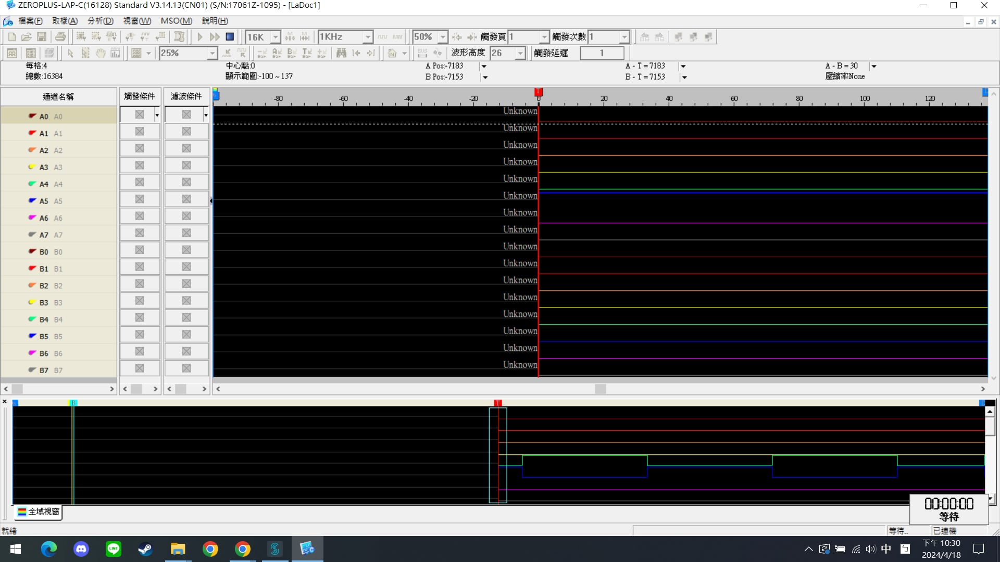

# Data Acquisition
## 【基本資料】
作業: HW6  
姓名: 林育新  
學號: R12631070  
GitHub: https://github.com/ax130885/Embeded_System/tree/main/hw06_Data_Acquisition

## 【實驗題目】
1. We provide an example code in “timer_trigger_adc” folder to setup ADC triggered by timer, sampling the signal of STM32 internal temperature sensor at a fixed frequency and generating an interrupt when each conversion finishes. Please modify the (a) trigger frequency and (b) sampling time of ADC. # 見 第一題題目.cpp  
   <br/>
2. We provide an example code in “timer_trigger_adc_DMA_ver” folder to setup ADC triggered by timer, sampling the signal of STM32 internal temperature sensor at a fixed frequency. Further, the code setups DMA to transfer the data from ADC data register to a specific buffer when each conversion finishes. When the top half of buffer is filled, the interrupt will be generated and print all data in the top half of buffer. When the bottom half of buffer is filled, the interrupt makes all data in the bottom half of buffer printed. We left some “to do”s in the code, please finish them. # 見 第二題題目.cpp  
   <br/>
   Note: The provided main.cpp in the above two tasks can replace the one in the mbed-os-empty example project. Then, it can be compiled and run on the stm32 iot node development board via Mbed Studio.  
   <br/>  
3. Here is an MbedOS microphone example which can record the sound in two second(https://github.com/janjongboom/b-l475e-iot01a-audio-mbedLinks to an external site.). Please modify the code such that the program executes continuously and periodically (You don’t need to preserve audio data or print it out). This code setups DMA to transfer audio data to PCM_Buffer. When the top and bottom half of PCM_Buffer are filled, the corresponding interrupts will generate. Please choose two GPIO pins as output and connect them to logic analyzer. Once the PCM_Buffer top half event occurs, toggle pin1’s output voltage. Once the PCM_Buffer bottom half event occurs, toggle pin2’s output voltage. By this way, you can observe the frequency of audio sampling.

Submission:  
Github URL of your project repository for your team  
Personal report with some discussions and experiences sharing  

## 【實驗流程】
### 【第一題】
1. new empty os
2. 把第一題題目.cpp丟進去，改成main.cpp
3. 修改ADC的(a)觸發頻率和(b)取樣時間
   ````C
   1. hadc1.Init.ClockPrescaler = ADC_CLOCK_SYNC_PCLK_DIV4; //ADC_CLOCK_ASYNC_DIV1;
   2. sConfig.SamplingTime = ADC_SAMPLETIME_2CYCLES_5; //ADC_SAMPLETIME_247CYCLES_5;
   3. htim1.Init.Prescaler = 4000 - 1; 
   4. htim1.Init.Period = 1000 - 1;
   ````
4. 說明
   ````
   本程式運作邏輯是由timer控制adc觸發。  
   每4000個系統時脈timer計數就會+1，而每數到1000就會輸出一次output。  
   因為設置了ADC_CLOCK_SYNC_PCLK_DIV4，所以每收到4次timer的output，adc的記數就會+1。
   而每當ADC數了ADC_SAMPLETIME_2CYCLES_5(代表2.5個clock)就會採樣一次。
   ````
5. 取樣時間：
   ````
   承上解釋，相當於每4000*1000*4*2.5個系統時脈才會採樣一次。 
   ````
6. 補充硬體細節，STM32L475VG 微控制器有三個時鐘源：
   ````
   X1：8 MHz 晶體振蕩器：這是 STM32L475VG 微控制器的一個時鐘源，頻率為 8 MHz。這個時鐘源可能用於系統時鐘或者其他模塊的時鐘。
   X2：32.768 KHz 晶體振蕩器：這是 STM32L475VG 微控制器的另一個時鐘源，頻率為 32.768 KHz。通常用於嵌入式 RTC（實時時鐘）模塊，用於提供精確的實時時鐘功能。
   X3：來自 ST-LINK MCU 的 8 MHz 時鐘：這是由 ST-LINK MCU（也就是與 STM32L475VG 微控制器連接的 ST-LINK 芯片）提供的時鐘源，頻率為 8 MHz。這個時鐘源可能用於通信或者其他與 ST-LINK MCU 通信相關的功能。   
   ````

### 【第二題】
1. new empty os
2. 把第二題題目.cpp丟進去，改成main.cpp
3. 程式碼當中提供了DMA（Direct Memory Access）的struct，
   修改註解to do的地方，讓ADC能夠過DMA執行。
   ````C
   void timer_count_callback()
   {    
      printf("last half\n");
      for (int i = (SAMPLE_BUFFER_SIZE/2); i < SAMPLE_BUFFER_SIZE; i++)
      {
         uint16_t val = HAL_ADC_GetValue(&hadc1);
         printf("%d : %d\n", i, val);
      }

   }

   void timer_count_half_callback()
   {    
      printf("first half\n");
      for (int i = 0; i < (SAMPLE_BUFFER_SIZE/2); i++)
      {
         uint16_t val = HAL_ADC_GetValue(&hadc1);
         printf("%d : %d\n", i, val);
      }

   }

   void HAL_ADC_ConvCpltCallback(ADC_HandleTypeDef *hadc)
   {
      //to do ..........................
      event_queue.call(timer_count_callback);
   }

   void HAL_ADC_ConvHalfCpltCallback(ADC_HandleTypeDef *hadc)
   {
      //to do ..........................
      event_queue.call(timer_count_half_callback);
   }
   ````
   ````c
   // HAL_ADC_Start_DMA(/*to do ........................*/);
   HAL_ADC_Start_DMA(&hadc1, (uint32_t *)sample_buffer, (SAMPLE_BUFFER_SIZE/2)); // ctrl點擊HAL_ADC_Start_DMA 可以看到API用法
   ````
4. 說明
   程式定義了一個256個uint16_t大小的暫存buffer，  
   每當記憶體半滿/全滿就透過DMA存入資料一次。
   並且透過
   ````c
   #define SAMPLE_BUFFER_SIZE  256
   uint16_t sample_buffer[SAMPLE_BUFFER_SIZE];
   ````
5. 取樣時間
   ````c
   取樣時間 = 4*2.5*12000*6000個系統clock

   hadc1.Init.ClockPrescaler = ADC_CLOCK_SYNC_PCLK_DIV4;//ADC_CLOCK_ASYNC_DIV1;
   sConfig.SamplingTime = ADC_SAMPLETIME_2CYCLES_5
   htim1.Init.Prescaler = 12000 - 1;
   htim1.Init.Period = 6000 - 1;
   ````

### 【第三題】
1. import https://github.com/janjongboom/b-l475e-iot01a-audio-mbed  
   ````
   這是一個錄製mic的範例，每次run以後會等待你按下l475e上的藍色按鈕。  
   當按下以後會錄製2秒的音訊並儲存為WAV檔案，並結束程式。  
   程式邏輯會設置一個2秒音檔長度的buffer，  
   並且在buffer半滿/全滿時，就會透過DMA輸出一次。  
   ````
2. 修改目標
   ````
   修改專案的功能，使其可以連續執行，而不會兩秒後就結束。
   不需要保留儲存檔案的功能。
   只要新增一個功能是，設置兩個GPIO腳位。
   每當buffer半滿時，腳位1=HIGH, 腳位2=LOW。
   而當buffer全滿時，腳位1=LOW, 腳位2=HIGH。
   ````
3. 修改內容
   1. 定義GPIO腳位
      ````c
      static DigitalOut first(D9);
      static DigitalOut last(D10);
      ````
   2. 原本處理前半和後半的callback function都是導到target_audio_buffer_full，  
      現在分開換成兩個不同的event。
      ````c
      void BSP_AUDIO_IN_HalfTransfer_CallBack(uint32_t Instance) {
         
         ...
         ...
         ...

         if (TARGET_AUDIO_BUFFER_IX >= TARGET_AUDIO_BUFFER_NB_SAMPLES) {
            // ev_queue.call(&target_audio_buffer_full); 換成
            ev_queue.call(&target_audio_buffer_half);
            return;
         }
      }

      void BSP_AUDIO_IN_TransferComplete_CallBack(uint32_t Instance) {
                  
         ...
         ...
         ...
         
         if (TARGET_AUDIO_BUFFER_IX >= TARGET_AUDIO_BUFFER_NB_SAMPLES) {
            ev_queue.call(&target_audio_buffer_full);
            return;
         }
      }
      裡面
      ````
         
   3. 修改event function 「target_audio_buffer_full」和新增「half版本」(內容相同)。  
      捨棄儲存wav file的功能，並且修改錄滿兩秒以後，  
      改成使用stop和新增deinit。否則下一輪init時會壞掉。  
      最後使用write讓GPIO有toggle的功能，由於只能輸入int值，本身不可toggle。  
      在\~int以後+2不知道為甚麼，剛好可以達到\~boolean的效果。
      ````c
      void target_audio_buffer_full() {
         printf("Total complete events: %lu, index is %lu\n", transfer_complete_events, TARGET_AUDIO_BUFFER_IX);

         // Stop audio recording
         int32_t ret = BSP_AUDIO_IN_Stop(AUDIO_INSTANCE);
         if (ret != BSP_ERROR_NONE) {
            printf("Error Audio Stop (%d)\n", ret);
         }

         // Deinitialize audio input
         ret = BSP_AUDIO_IN_DeInit(AUDIO_INSTANCE);
         if (ret != BSP_ERROR_NONE) {
            printf("Error Audio DeInit (%d)\n", ret);
            return;
         }

         first.write((~first.read()+2));
         printf("first=%d, ~first=%d\n", first.read(), (~first.read()+2));
         last.write((~last.read()+2));
         printf("last=%d, ~last=%d\n", last.read(), (~last.read()+2));

         printf("full finished\n");
         
         // Re-initialize audio input for the next recording
         ret = BSP_AUDIO_IN_Init(AUDIO_INSTANCE, &MicParams);
         
         if (ret != BSP_ERROR_NONE) {
            printf("Error Audio Init in target_audio_buffer_full() (%ld)\r\n", ret);
            return;
         }

         // Start recording again
         start_recording();
      }
      ````
   4. 新增以下這段 定義GPIO初始值 之後才能toggle
      ````c
      int main() {
         printf("Hello from the B-L475E-IOT01A microphone demo\n");

         if (!TARGET_AUDIO_BUFFER) {
            printf("Failed to allocate TARGET_AUDIO_BUFFER buffer\n");
            return 0;
         }

         // set up the microphone
         MicParams.BitsPerSample = 16;
         MicParams.ChannelsNbr = AUDIO_CHANNELS;
         MicParams.Device = AUDIO_IN_DIGITAL_MIC1;
         MicParams.SampleRate = AUDIO_SAMPLING_FREQUENCY;
         MicParams.Volume = 32;

         int32_t ret = BSP_AUDIO_IN_Init(AUDIO_INSTANCE, &MicParams);

         if (ret != BSP_ERROR_NONE) {
            printf("Error Audio Init (%ld)\r\n", ret);
            return 1;
         } else {
            printf("OK Audio Init\t(Audio Freq=%ld)\r\n", AUDIO_SAMPLING_FREQUENCY);
         }

         // 新增以下這段 定義GPIO初始值 之後才能toggle
         first.write(true);
         printf("first=%d, ~first=%d\n", first.read(), (~first.read()+2));
         last.write(false);
         printf("last=%d, ~last=%d\n", last.read(), (~last.read()+2));

         // hit the blue button to record a message
         printf("Press the BLUE button to record a message\n");
         static InterruptIn btn(BUTTON1);
         btn.fall(ev_queue.event(&start_recording));

         ev_queue.dispatch_forever();
      }
      ````
   5. 原本處理前半和後半的callback function都是導到target_audio_buffer_full，  
      現在分開換成兩個不同的event。
      ````c
      void BSP_AUDIO_IN_HalfTransfer_CallBack(uint32_t Instance) {
         
         ...
         ...
         ...

         if (TARGET_AUDIO_BUFFER_IX >= TARGET_AUDIO_BUFFER_NB_SAMPLES) {
            ev_queue.call(&target_audio_buffer_half);
            return;
         }
      }

      void BSP_AUDIO_IN_TransferComplete_CallBack(uint32_t Instance) {
                  
         ...
         ...
         ...
         
         if (TARGET_AUDIO_BUFFER_IX >= TARGET_AUDIO_BUFFER_NB_SAMPLES) {
            ev_queue.call(&target_audio_buffer_full);
            return;
         }
      }
      裡面
      ````
   6. a
      ````c
      
      ````

4. 取樣時間
   ````c
   系統取樣頻率，輸出的結果為16000。
   printf("%d", AUDIO_SAMPLING_FREQUENCY)

   
   設置buffer大小為取樣兩秒的int16_t矩陣。
   static size_t TARGET_AUDIO_BUFFER_NB_SAMPLES = AUDIO_SAMPLING_FREQUENCY * 2; // 32000 = 16000 * 2
   static int16_t *TARGET_AUDIO_BUFFER = (int16_t*)calloc(TARGET_AUDIO_BUFFER_NB_SAMPLES, sizeof(int16_t));

   每當buffer半滿/全滿時會觸發對應的callback function。

   ````
5. 實驗結果
   邏輯分析儀設置記憶體大小為16khz，取樣頻率為1khz，並且顯示設定25%。  
   所以在下面可以看到掃描16k/1k*0.25=4秒的結果。  
   而我們的程式設定2秒為一個完整的wave(buffer長度2秒)，因此得證實驗結果正確。  
   |  |
   | :--------------------: |
   | *邏輯分析儀實驗結果。* |

## 【實驗討論】
在實作第三個專案的過程中遇到很多問題。首先是原本的程式只會執行一次兩秒的錄製，而我們需要將其修改為可以無限執行下去。如果直接在結束錄製後，直接拉回到開始錄製，會在開始錄製初始化時觸發error後return中止程式。為了解決這個問題，我試著修改初始化、暫停錄製、繼續錄製的方法(pause、stop、resume、start)等，但都沒解決問題。研究了半天以後才發現，原來重點是結束錄製時，需要新增一個deinit的函式才能解決。  
<br/>
另一個問題是，我們本來想使用hw1 LED中使用的寫法去定義腳位，如此一來可以直接藉由pin=0, pin=1的方式，非常簡單的修改輸出，並且可以使用pin=\~pin達到toggle的功能。但我發現這樣寫的話，雖然編譯的時候沒有問題，但最後腳位上完全量測不到任何變動。僅能透過hw5 PWM中使用pin.read(), pin.write(int)的方式操作。但問題出在，由於這種寫法的IO是int而非boolean，所以沒辦法直接使用\~來達到toggle的功能。只能新增一個event來模擬兩個狀態的有限狀態機，並且在兩個狀態中設置一個狀態為01，另一個狀態設置10。  
<br/>
但是這種解法又導致另一個問題，不知道因為什麼原因，我發現程式完全不會進到前半的event當中。最後湊到一個怪怪的解法是，我發現\~int +2就可以達到\~boolean的效果。因此就可以在後半的event中設置GPIO toggle的功能。才勉強達到這次實驗所需的效果。