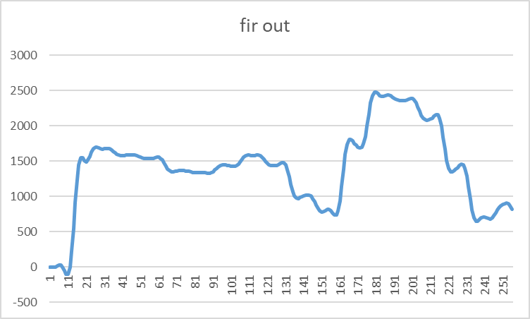

# DSP
## 【基本資料】
作業: HW7  
姓名: 林育新  
學號: R12631070  
GitHub: https://github.com/ax130885/Embeded_System/tree/main/hw07_DSP

## 【實驗題目】
#### Mbed-DSP programming
Design a DSP program using Mbed Studio to process the chosen sensor data ( such as 3D accelerators or gyroscopes) from STM32 IOT Node development board.  
1. Your DSP program can implement a low pass filter, like FIR example, or other algorithms, such as FFT, etc.
2. Before testing real data, you should test the program using a known signal to show the correctness.

#### Review question:
What is the Range of Representable Values in the ARM fixed point q15 (Q1.15) format?  
  
Hint:  
* Q format: please refer to https://en.wikipedia.org/wiki/Q_(number_format)  
* ARM q15 is a Q1.15 format fixed-point number.  
 

Submission:  
Github URL of your project repository for your team  
Personal report with some discussions and experiences sharing  
 

## 【程式實作】FIR低通濾波
1. new empty program
2. add lib https://os.mbed.com/teams/mbed-official/code/mbed-dsp  # DSP庫
3. add lib http://os.mbed.com/teams/ST/code/BSP_B-L475E-IOT01/  # 感測器庫(可用別的方法輸入資料)
4. 修改編譯器設定，進入 mbed-dsp/cmsis_dsp/TransformFunctions/arm_bitreversal2.S ，進到第43行，在 #if defined(__CC_ARM) //Keil 之前，新增一行 #define __CC_ARM。
5. 撰寫main.c (或直接使用本專案的main)。仿照 https://arm-software.github.io/CMSIS_5/DSP/html/group__FIRLPF.html 最底下的example程式自己撰寫。因為dsp module被mbed改過，所以沒辦法直接完全照抄code。
6. 把輸出的值貼到excel當中繪製出波形。
   |  |
   | :--------------------: |
   |  *感測器收到的Input*   |
   
   |                |
   | :------------------------------------: |
   | *低通濾波過的output，可以看到變平滑。* |

## 【問題回答】
ARM fixed-point Q1.15 格式是一種用於定點數數字的表示方式。  
如果只寫 Q.15 ，代表預設整數位為 1 ，也就是 Q1.15 。  
定點數的優點在於事先已經知道計算範圍，所以相比浮點數的運算更快，並且不需要FPU。  
當表示負數的時候使用2的補數。  
* 「1」表示用於整數部分的位數和正負號的部分只有 1 個位元。所以如果只有設置為 1 代表一定是 +-0.XXXX。  
* 「15」表示有 15 個位元用於小數部分。
  
根據這種格式，可表示值的範圍可以如下計算：  
* 最大正值發生在整數位為 0（表示正數）且所有小數位為 1 的情況下。這給出了二進制中的 0.111111111111111，大約等於十進制中的 0.999969482421875。  
* 最小負值發生在整數位為 1（表示負數）且所有小數位為 0 的情況下。這給出了二進制中的 1.000000000000000，當用二補數表示法解釋時，等於十進制中的 -1。  
* 因此，ARM 固定點 Q1.15 格式的可表示值範圍是從 -1 到大約 0.999969482421875。  
 

## 【實驗討論】
這次實作，我們本來想做FFT。但是實作了以後發現，不知道為甚麼FFT出來的結果都十分奇怪。查了許多不同網路上的範例，確認自己的寫法應該正確無誤。  
* cfft的問題是輸出跟輸入一樣，完全沒有任何變化；  
* rfft的問題是當input size小的時候，輸出幾乎都是0，而size大的時候，輸出幾乎都大到爆炸，而且就算只輸入單一頻率的波形，頻譜圖也會出現一堆亂七八糟的東西。
  
最後與助教研究許久，也找不出問題。最後只好改回去做FIR低通濾波。不過因為有前面在FFT撞牆的經驗，FIR算是很快就做出來了。  