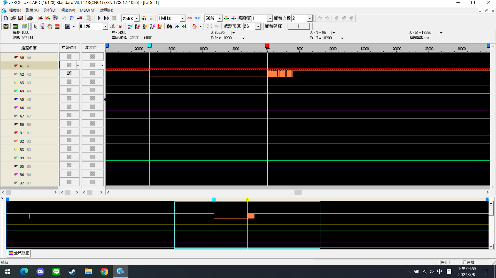
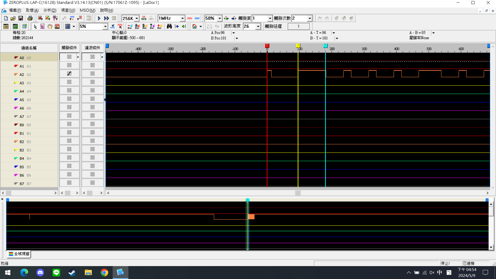

# DHT11 溫溼度感測
## 【基本資料】
作業: HW8  
姓名: 林育新  
學號: R12631070  
GitHub: https://github.com/ax130885/Embeded_System/tree/main/hw08_DHT11%E6%BA%AB%E6%BA%BC%E5%BA%A6%E6%84%9F%E6%B8%AC  

## 【實驗題目】
1. Observe the DHT11 signal using a Logic  Analyzer.  Show some screen shots and steps in your lab.
2. Explain or discuss the following terms:
   1. What is Linux IIO subsystem? Please explain IIO in terms of its purpose and user interface provision.  
      (references: https://www.kernel.org/doc/html/latest/driver-api/iio/index.html)  
      (To access IIO devices, Linux application can use libiio: https://analogdevicesinc.github.io/libiio/v0.20/index.html)  
   2. ow is the efficiency difference when compared between interrupt-driven I/O and programming I/O (polling I/O)?  
<br/>

## 【問題回答與實作】
#### 使用邏輯分析儀觀察 DHT11 訊號。顯示實驗中的一些螢幕截圖和步驟。
````python
# 全程在RPI當中操作
# CircuitPython-DHT Library is based on CircuitPython Library
sudo pip3 install --upgrade setuptools
sudo pip3 install --upgrade adafruit-python-shell
wget https://raw.githubusercontent.com/adafruit/Raspberry-Pi-
Installer-Scripts/master/raspi-blinka.py
sudo python3 raspi-blinka.py

# Installing the CircuitPython-DHT Library
sudo apt-get install libgpiod2
sudo pip3 install adafruit-circuitpython-dht

# Testing the CircuitPython DHT Library
git clone https://github.com/adafruit/Adafruit_CircuitPython_DHT.git
cd Adafruit_CircuitPython_DHT

# 打開 examples/dht_simpletest.py 更改一開始dhtDevice的定義為
dhtDevice = adafruit_dht.DHT11(board.D4, use_pulseio=False)

# 用python程式持續讀值
python examples/dht_simpletest.py 
````
````bash
vim /boot/config.txt
# 添加這一行在文件最後 ctrl+F到最後 :o插入下一行 修改完成以後:wq保存並退出
dtoverlay=dht11
sudo reboot

# 重開之後
cd /sys/bus/iio/devices/iio:device0.
cat in_temp_input # 即可得到溫度感測的值
cat in_humidityrelative_input # 即可得到濕度的值
# 如果cat顯示IO錯誤 是DHT11版本的問題
````
````
邏輯分析儀設定
memory size = 256K
sample rate = 1M/Hz  (1us/sample)
zoom = 1%
觸發條件 raise edge
觸發次數 2
````
<!-- 如果要做1x4的表格 -->
<!--
|  |  |  |  |
| :------------------: | :------------------: | :------------------: | :------------------: |
-->
|  |  |
| :------------------: | :------------------: |
|  |  |

<div align="center">Fig. 特別長的High=1;而較短的Hight代表0</div>
<br/>

#### 什麼是Linux IIO子系統？請解釋 IIO 的用途和使用者介面。

#### 中斷和輪詢I/O之間的效率差異如何？

<br/>

## 【實驗討論】
因為鄰近課程尾聲，要開始做期末專題，這次實驗是課程以來最簡單的一次。不過在實作過程中還是有遇到一點小問題，就是我自己也有其他的DHT11模組。在使用老師提供的程式時，不知道為甚麼，會辨識不到I/O。但是用先前原本DHT11的程式，其實還是能夠正常執行，證明我原本的DHT11是沒有壞的。並且老師新給的DHT11，也能在我先前的程式當中順利執行。可能是DHT11版本的問題導致的，但IC封裝並沒有產品的型號，實在很難判斷到底是什麼問題。