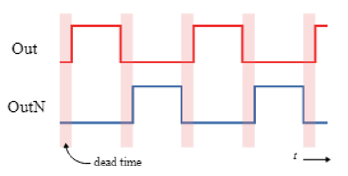
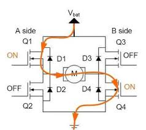
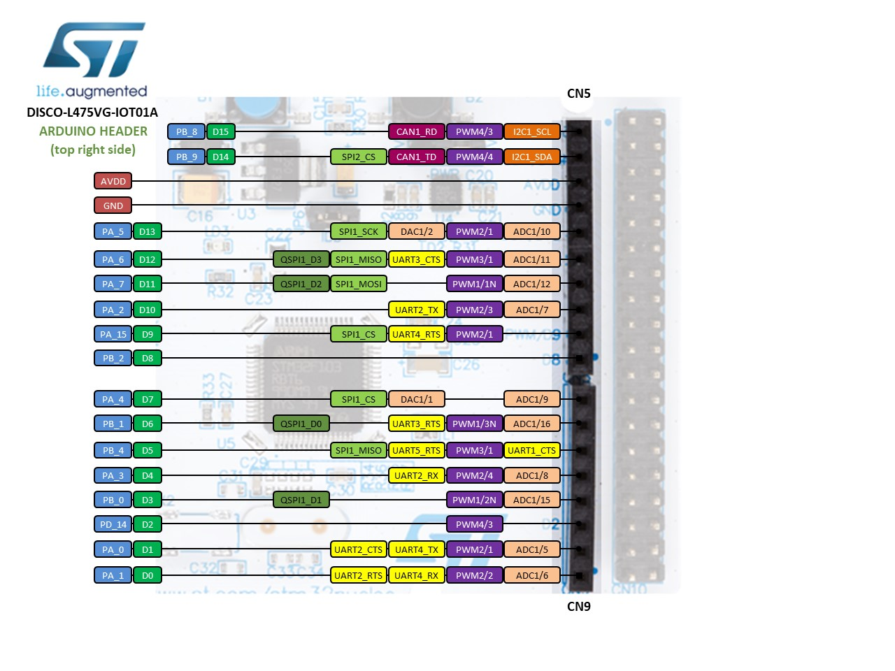
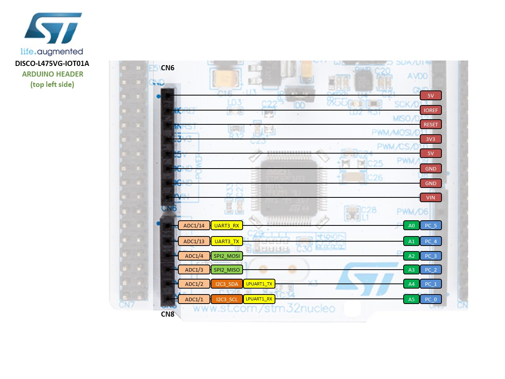

# PWM & Logic Analyzer
### 【PWM】
PWM是為了在數位電路當中模擬類比的訊號。  
假設數位的0, 1對應到類比的0V, 5V，  
如果我們現在想要一個3V的訊號，可以控制輸出的方波duty cycle=0.6。  
這樣以等效功率來看就與3V的直流訊號相同。  
而這種設置方波的方式就稱為duty cycle。  

### 【實驗題目】
以STM32實作具有deadband的complement pwm wave。  
並且輸出訊號，以logic analyzer觀察波形。  
輸出結果會類似下圖:
  

### 【deadband的目的】
以下圖舉例，將Out與OutN分別接上Q1和Q2，就可以控制直流馬達的正反轉。  
deadband是為了避免輸入產生延遲時，兩個電晶體同時ON，造成電流直接短路，而不會流經馬達。  

### 【實驗流程】
1. import https://github.com/ARMmbed/mbed-os-snippet-PwmOut_ex_3  
2. 修改main.cpp。  
   1. 依照下方附圖定義PWM輸出的PIN腳(本專案中設為D9, D10)。  

      |  |
      | :--------------------: |
      |   *L745E 腳位圖 左*    |

      |  |
      | :----------------------: |
      |    *L745E 腳位圖 右*     |

   2. 實作PWM的具體程式。
   
3. 下載logic analyzer操作軟體。  
   1. 下載說明 https://www.youtube.com/watch?v=gULjmHH_nKE  
   2. 下載網址 https://www.zeroplus.com.tw/logic-analyzer_tw/products.php?pdn=1&product_id=239  
   點擊software，選擇最新版下載。  
4. 調整LA軟體中，上方工具列的取樣頻率、記憶體大小、觸發比例、縮放大小等，  
   設置右邊的通道可以鎖定輸出顯示在raising / falling，  
   並且拖動Bar來量測具體的值。
5. 實驗結果
   可以看到我們設置了100ms週期的方波，並且duty cycle各為40%, deadband為20%。
   |  |
   | :-----------------------: |
   |        *實驗結果*         |

### 【實驗討論】
一開始在實作complement的功能時，因為要輸出兩個波形，我本來以為要用muti-thread的方式實現。但在嘗試之後發現，其實直接設置PWM就可以，完全不用設置thread。  
另外因為PWM函式庫本身沒有提供延遲相位的功能，一開始本來想使用sleep或wait的方式來達到延遲相位的效果。但實作以後發現，這樣設置雖然可以延遲函數啟動，可是沒有延遲相位的功能。  
最後我們將PWM設置為1ms 週期, duty cycle = 100% or 0% 來模擬logic High & Low。並且搭配event_quene，用類似finite state machine的寫法，讓波形在High, deadband, Low三種狀態中無限loop，才達到輸出的結果。  
  
※此外要特別注意如果以PWM模擬logic High & Low效果的話，記得週期要設置為三種狀態的公因數。因為此時的週期會變成類似解析度的概念，可能導致邏輯延遲反應而有奇怪的波形輸出。