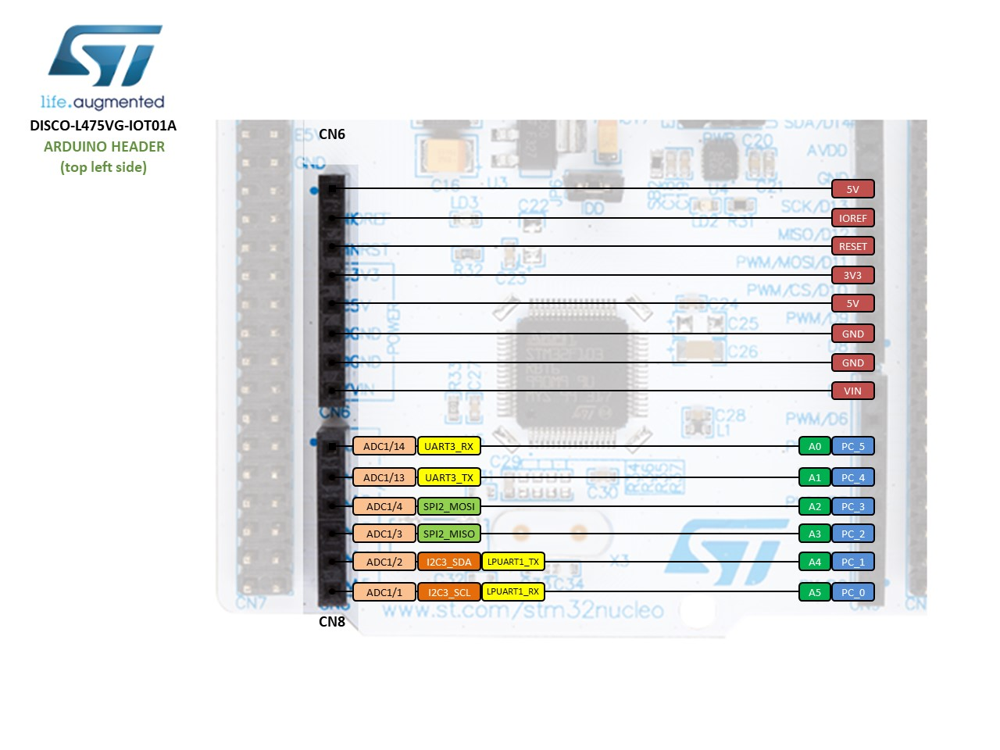
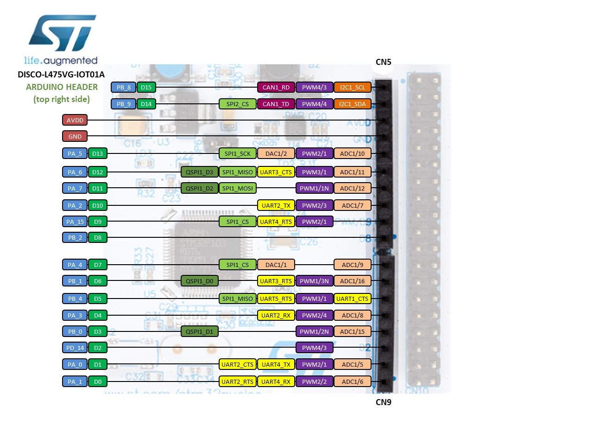

# BLE(低功耗藍芽)基本存取
### 【GATT架構概念說明】
1. 一個藍芽設備可能有多個service (心率、溫濕度、加速度等)。
2. 一個service可能有多個characteristics。
   以心率為例有三個特徵:
   measure(notify,量測值)
   location(read,量測設備在身體哪裡)
   control(write,控制要不要量)
3. 一個characteristic 包含value declaration descriptor(不一定有) 的內容。
4. 一個特徵僅能存一個value和declaration但可能有多個descriptor。
5. declaration裡面的property有以下用法:
   Broadcase(0x01)
   Read(0x02)
   Write Without Response(0x04)
   Write(0x08)
   Notify(0x10)
   Indicate(0x20)
   Authenticated Signed Writes(0x40)
   Extended Properties(0x80)
6. permission容易與property搞混，
   差別在於permission主要是用來限制存取的權限，有以下幾種用法:
   READ（讀取）：0x01
   WRITE（寫入）：0x02
   READ_ENCRYPTED（加密讀取）：0x04
   WRITE_ENCRYPTED（加密寫入）：0x08
   READ_ENCRYPTED_MITM（加密讀取 + MITM）：0x10
   WRITE_ENCRYPTED_MITM（加密寫入 + MITM）：0x20
   WRITE_SIGNED（寫入 + 簽名）：0x40
   WRITE_SIGNED_MITM（寫入 + 簽名 + MITM）：0x80
   其中MITM和簽名是防駭的安全機制。

|  |
|:--:|
| *藍芽GATT概念圖1* |

|  |
|:--:|
| *藍芽GATT概念圖2* |

### 【write, read, notify, indicate】
1. 一個特徵在BLE scanner當中有四種使用方式可勾選 (write read notify indicate)(可複選)。
2. Notify和indicate類似於trigger的概念，在bluepy 中可以設置偵測一定秒數的notify訊號 通常與條件迴圈一起使用。
3. notify只要單方面trigger就可以直接執行，indicate需要等待另一方回應以後才會執行。
4. 只勾notify / indicate而沒有勾write / read時 並不會傳value!

### 【UUID】
1. UUID類似於變數的概念，實際上是由16bit的hex組成0x????，並不像是傳統的變數以名字儲存。
2. 使用者可以自行設定某個數字代表某個功能，但其中有一些官方保留的UUID，可見ref的連結。
3. UUID在設備內可能不唯一，例如CCCD就會在多個chacrateristic當中出現。
4. 在藍芽內傳輸資料時，類似於高階語言中都是用變數在call value，這裡要用UUID來call value。(用法見 notify.py)

### 【CCCD】
CCCD實際的UUID值為0x2902，是一個官方特別保留的UUID。  
在characteristic的descriptor中使用，用來宣告這個characteristic使否要啟用notify或是indicate的功能。(property和這裡都要宣告)  
將這個descriptor內的value  
設為b"\x01\x00"代表啟用notify  
設為b"\x02\x00"代表啟用indicate  
設為b"\x00\x00"代表禁用notify & indicate  
若輸入任意其他值可能導致錯誤。  

### 【Handle】
Handle 類似於相對地址的概念，相同層級內的handle通常是連續的。  
但不同層級或跨層級的handle間是完全沒關係。

### 【BLE scanner操作】(IOS限定免費, android可以改用apk下載BLE tools)

|  |
|:--:|
| *Step 1. 底下選擇advertising，右上+任意功能，此處用BLE DEVICE示範。* |

|  |
|:--:|
| *Step 2.滑動打開BLE DEVICE以後點擊進入，再選擇最下面的services進入。* |

|  |
|:--:|
| *Step 3.service UUID為0x9999可點擊i修改，同理characteristic的UUID 0x9191也可以修改。要在setvalue選擇要啟用的傳輸方式(write, read, notify, indicate)，此處為例要選擇notify + write，接著點擊灰色notify的區域即可傳值。若點擊右上角的C可以read。* |

|  |
|:--:|
| *Step 4.記得修改notify.py的UUID為剛剛自己設置的值。* |

|  |
|:--:|
| *Step 5.。執行結果:在藍芽輸入的hex值記得透過ascii轉換為字符，輸入字符則會轉換為hex值。* |

### 【reference】
bluepy API: https://ianharvey.github.io/bluepy-doc/  

官方保留UUID說明文件: https://www.bluetooth.com/wp-content/uploads/Files/Specification/HTML/Assigned_Numbers/out/en/Assigned_Numbers.pdf?v=1711651089126
